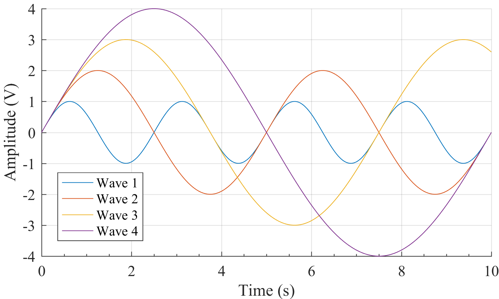

# matlab-printfg #
A collection of [MATLAB®](http://www.mathworks.com/products/matlab/) functions that aim to simplify saving formatted figures for printing.

## Usage
To print a figure to a file, capture the figure's handle and pass it to the function.
For example, to save a figure to a file named _'figure.png'_:

```matlab
hf = figure;
plot(1:10,1:10);
printfg(hf, 'figure', 'png');
```

You can also save a figure to multiple files with different extensions at the same time:

```matlab
printfg(hf, 'figure', {'png', 'eps'});
```

Any extension supported by MATLAB's native _saveas_ and _print_ functions is also supported by _printfg_, with the following differences:
- _eps_ is a shortcut for PostScript Color Level 2 (Level 3 on R2014b), as opposed to the default monochrome output.


### Size
Printing size can be specified as a two-element vector defining width and height in __points__.

```matlab
printfg(hf, 'figure', {'png', 'eps'}, [500, 250]);
```

### Properties
Figure properties can be specified as a struct array, and will be applied to any corresponding objects found under the figure handle.

```matlab
%% Figure properties
prop.Axes.XMinorTick = 'on';
prop.Axes.FontName = 'Times New Roman';
prop.Line.LineWidth = 2;
prop.Title.FontSize = 12;

%% Export figure
printfg(hf, 'figure', {'png', 'eps'}, [500, 250], prop);
```

## Samples
Check out some examples of the output produced by _printfg_ inside the _samples_ subfolder.



## Known Issues
- MATLAB R2014b seems to produce different results with printing sizes than earlier versions.
- Figures with multiple axes are not supported yet (i.e. plots produced by _plotyy_).

## License
matlab-printfg is open-sourced software licensed under the [MIT License](http://opensource.org/licenses/MIT). For the full copyright and license information, please view the LICENSE file that was distributed with this source code.
